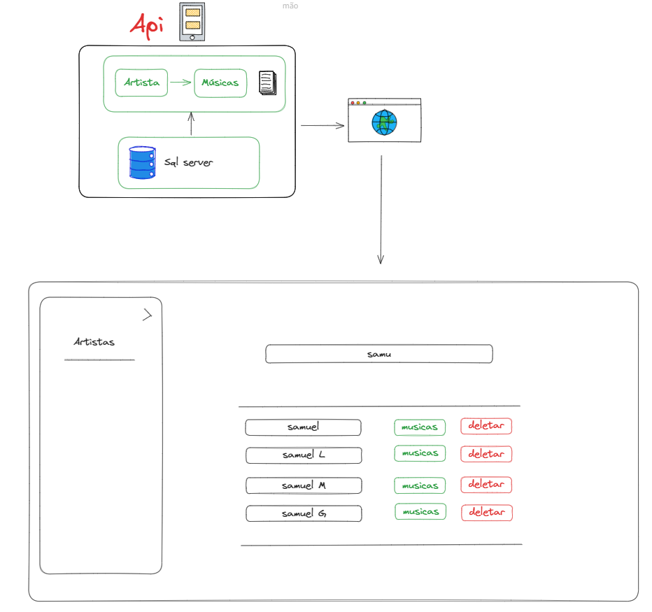
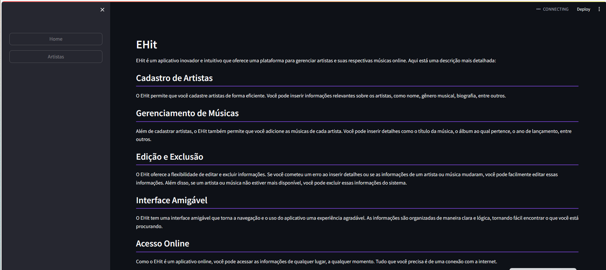
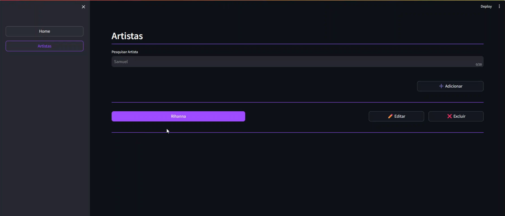
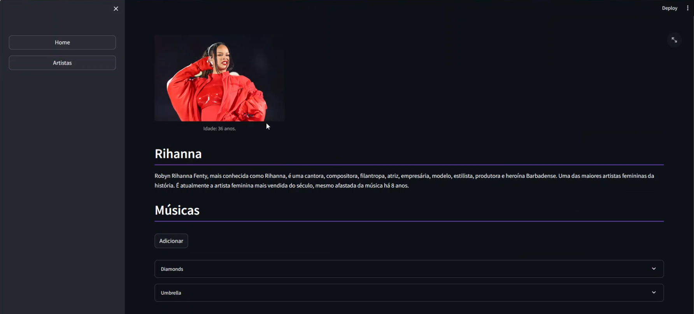
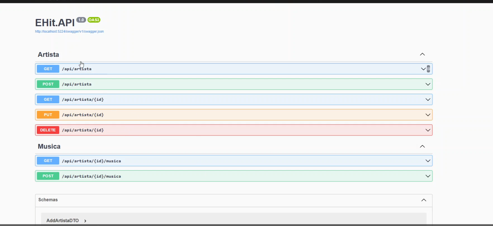

## EHit 🌐

#### Este projeto é uma API e uma interface WEB.

#### Prototipo



#### Telas







#### API



### Tecnologias utilizadas 💡

- Python: Front-End
- ASP.NET Web API: API .NET 7
- Entity Framework Core: persistência e consulta de dados.
- SQL Server: banco de dados relacional.

## Instalação

### Requisitos

Antes de começar, verifique se você tem os seguintes requisitos instalados:

- [.NET SDK 7.0](https://dotnet.microsoft.com/download/dotnet/7.0): A versão do .NET Framework necessária para executar a API.
- [SQL Server](https://www.microsoft.com/en-us/sql-server): O banco de dados utilizado para armazenar os dados.

### Clone

Clone o repositório do GitHub:

```bash
git clone https://github.com/[seu-usuário]/EHit.git
```

### Navegue até a pasta do projeto:

```bash
cd EHit.API
cd EHit.WEB
```

### Abra o projeto na sua IDE de preferência (a IDE utilizada para desenvolvimento foi o Visual Studio)

### Restaure os pacotes:

```bash
dotnet restore
```

### Configure o banco de dados:

1. Abra o arquivo `appsettings.json`.
2. Altere as configurações do banco de dados para corresponder ao seu ambiente.

### Execute a API:

Para executar a API, use o seguinte comando:

```bash
dotnet run
```

### Execute a Aplicação WEB:

Para executar a aplicação web, use o seguinte comando:

```bash
streamlit run /main.py
```

### Lembre-se de substituir [seu-usuário] pelo seu nome de usuário do GitHub.

Este projeto foi criado para fins didáticos e não abrange todas as regras e conceitos necessários de uma aplicação real em produção.\*
